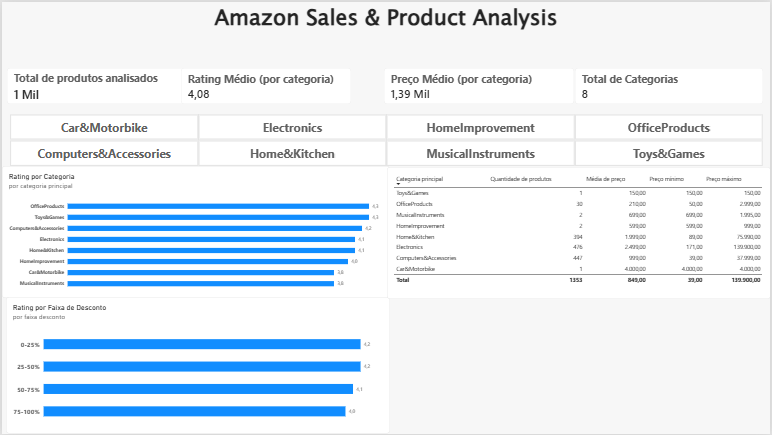

# 🛒 Amazon Sales & Product Analysis

Pipeline de dados construído no Databricks para analisar um catálogo de produtos
vendidos na Amazon (Índia), explorando a relação entre categoria, preço, desconto
e avaliação dos clientes.

O projeto cobre o ciclo completo: ingestão de dados brutos (incluindo tratamento de
um CSV com problemas reais de formatação), transformação em camadas (arquitetura
Medallion), três tabelas analíticas prontas para consumo, e um dashboard interativo
no Power BI.

**Tecnologias utilizadas:**
- Databricks (PySpark, Delta Lake, Unity Catalog)
- SQL, Expressões Regulares (Regex)
- Power BI

**Fonte dos dados:** Amazon Sales Dataset (Kaggle)

---

## 🏗️ Arquitetura do Pipeline

Arquitetura **Medallion** (Bronze → Silver → Gold), com cada camada em notebooks
separados, pensando em uma futura orquestração via Databricks Workflows.

CSV (Kaggle)
│
▼
Volume (Unity Catalog)
│
▼
🥉 Bronze → dado bruto, 1.465 linhas, sem nenhuma transformação
│
▼
🥈 Silver → 1.353 linhas: filtro de qualidade + conversão de tipos
│
▼
🥇 Gold → 3 tabelas agregadas, prontas para consumo em BI
│
▼
Power BI


### 🥉 Bronze — dado bruto
```python
df = spark.read.csv(
    "/Volumes/files/amazon_files/volumes/amazon.csv",
    header=True,
    inferSchema=True
)
df.write.format("delta").mode("overwrite").saveAsTable("files.amazon_files.amazon_bronze")
```
Nenhuma transformação aplicada — inclusive as linhas com problemas de formatação
foram preservadas aqui, seguindo o princípio de que a Bronze deve ser uma cópia
fiel da fonte original.

### 🥈 Silver — qualidade e tipos corretos
Duas frentes de trabalho:

**1. Remoção de linhas corrompidas (112 de 1.465, ~7,6%)**
O CSV original tinha linhas com colunas desalinhadas — valores de uma coluna
aparecendo em outra, causado por parsing malformado (provavelmente aspas não
escapadas em campos de texto livre como `about_product`). Essas linhas foram
identificadas e removidas com base no formato inválido da coluna `rating`:
```python
df_silver = df_bronze.filter(F.col("rating").rlike(r"^[0-9]\.[0-9]$"))
```

**2. Conversão de tipos**
Colunas de preço, desconto e avaliação vieram como texto (`"₹399"`, `"64%"`,
`"24,269"`), e foram convertidas para tipos numéricos:
```python
df_silver = df_silver.withColumn(
    "discounted_price",
    F.regexp_replace(F.col("discounted_price"), "[^0-9.]", "").cast("double")
)
# mesma lógica para actual_price, discount_percentage (÷100), rating, rating_count
```

### 🥇 Gold — três tabelas analíticas

| Tabela | Pergunta que responde |
|---|---|
| `amazon_gold_categoria` | Quais categorias têm melhor avaliação? |
| `amazon_gold_desconto` | Desconto maior está associado a rating melhor ou pior? |
| `amazon_gold_preco` | Como os preços se distribuem por categoria? |

As três usam mediana (não soma/média) para as métricas de rating e preço, por
motivos detalhados na seção de Descobertas abaixo.

---

## 🔍 Principais Descobertas

### 1. Tamanho de amostra extremo entre categorias

O dataset tem 8 categorias principais, mas a distribuição é muito desigual:
`Electronics` (476 produtos) e `Computers&Accessories` (447) dominam o volume,
enquanto `Car&Motorbike` e `Toys&Games` têm **apenas 1 produto cada**. Qualquer
métrica para essas categorias pequenas (rating, preço) representa um produto
isolado, não um padrão de categoria — por isso o dashboard mantém a contagem de
produtos sempre visível ao lado de qualquer métrica agregada.

### 2. Desconto maior correlaciona com rating ligeiramente menor

Produtos com desconto entre 75-100% têm mediana de rating de 4.0, contra 4.2 na
faixa de 0-25%. A diferença é pequena, mas consistente em todas as faixas
intermediárias. Isso não implica causalidade — pode refletir produtos de giro
lento sendo descontados, marcas menos conhecidas, ou outros fatores não capturados
pelo dataset.

### 3. "Total de reviews" por categoria era uma métrica enganosa

Ao investigar por que `Electronics` somava quase 15 milhões de reviews, descobrimos
que vários produtos da mesma marca (Amazon Basics, boAt, Redmi) compartilhavam
contadores de `rating_count` quase idênticos — sinal de que a extração de dados
capturou um número agregado da marca, não de produtos individuais. A solução foi
trocar a soma pela **mediana** de `rating_count` por categoria, uma métrica muito
mais resistente a esse tipo de duplicação.

---

## 🛠️ Desafios e Como Resolvi

### 1. CSV com colunas desalinhadas (112 linhas)

**Problema:** ao inspecionar a coluna `rating`, encontrei valores impossíveis
como `"₹9,999"` ou nomes de categoria inteiros. Investigação revelou que os
valores de várias colunas haviam "deslizado" para a direita em certas linhas.

**Solução:** quantifiquei o problema com uma expressão regular (`rlike`),
confirmei a causa com inspeção visual de `truncate=False`, e decidi remover as
112 linhas afetadas (7,6% do dataset) em vez de tentar reconstruí-las, já que o
deslocamento era inconsistente entre linhas.

**Aprendizado:** `inferSchema=True` não detecta corrupção estrutural — só valida
tipo de dado. Validação de **conteúdo**, não só de **tipo**, é necessária em
dados reais.

### 2. Bug de regex removendo o ponto decimal

**Problema:** depois de converter os preços, encontrei 13 linhas onde
`discounted_price` era **maior** que `actual_price` — uma impossibilidade
lógica para preços promocionais.

**Causa raiz:** a expressão `regexp_replace(coluna, "[^0-9]", "")`, usada para
remover o símbolo `₹`, também removia o **ponto decimal** quando presente. Um
preço de `₹176.63` virava `17663`, inflando o valor em 100x.

**Solução:** troquei o padrão para `"[^0-9.]"`, preservando o ponto. Validei a
hipótese comparando o valor corrigido com o cálculo reverso a partir de
`discount_percentage` — a matemática bateu exatamente, confirmando a causa raiz
antes mesmo de aplicar a correção definitiva.

**Aprendizado:** o código rodou sem nenhum erro nas duas versões (certa e
errada) — reforça que testes de sanidade com relações lógicas entre colunas
(preço com desconto nunca maior que o original) são essenciais para pegar bugs
silenciosos.

### 3. Modelagem de dados no Power BI: nem toda tabela se relaciona

**Problema:** um slicer de categoria, criado a partir de `amazon_gold_categoria`,
não filtrava o gráfico vindo de `amazon_gold_desconto`.

**Causa:** as duas tabelas não compartilham nenhuma coluna em comum —
`categoria_principal` e `faixa_desconto` são dimensões independentes, criadas
por agregações diferentes a partir da mesma Silver.

**Solução:** em vez de forçar um relacionamento artificial, documentei a
limitação diretamente no dashboard com uma nota visual, mantendo os dois
gráficos como análises de escopos diferentes, mas transparentes sobre isso.

**Aprendizado:** uma tabela Gold otimizada para uma pergunta nem sempre serve
para outra. Resolver isso de verdade exigiria uma quarta tabela, agrupando por
categoria *e* faixa de desconto simultaneamente — documentado como próximo
passo.

---

## 📊 Resultado Final

Dashboard interativo no Power BI, desenhado para a persona de **analista de
dados**: KPIs gerais no topo, filtro de categoria interativo, gráficos
comparativos e uma tabela detalhada de preços — tudo com avisos explícitos sobre
limitações de amostra e de escopo de filtro.



## 🚀 Próximos Passos

- [ ] Criar uma quarta tabela Gold cruzando categoria **e** faixa de desconto,
      permitindo que o slicer filtre ambos os gráficos ao mesmo tempo.
- [ ] Investigar a fonte dos contadores de review duplicados entre produtos da
      mesma marca, possivelmente filtrando por `product_id` único antes de
      agregar.
- [ ] Automatizar o pipeline com Databricks Workflows.
- [ ] Adicionar testes de qualidade de dados automatizados (ex: `discounted_price
      < actual_price` como validação recorrente, não só pontual).

## 📁 Estrutura do Repositório

amazon-sales-analysis/
├── README.md
├── notebooks/
│ ├── 01_exploracao_amazon.py
│ ├── 02_bronze_amazon.py
│ ├── 03_silver_amazon.py
│ ├── 04_gold_categoria.py
│ ├── 05_gold_desconto.py
│ └── 06_gold_preco.py
└── images/
└── dashboard_overview.png

---

**Autor:** [Igor de Souza Aguiar](https://github.com/IgorSouzDEV)  
**LinkedIn:** [Igor de Souza Aguiar](https://www.linkedin.com/in/igor-de-souza-aguiar-1259a9168/)
